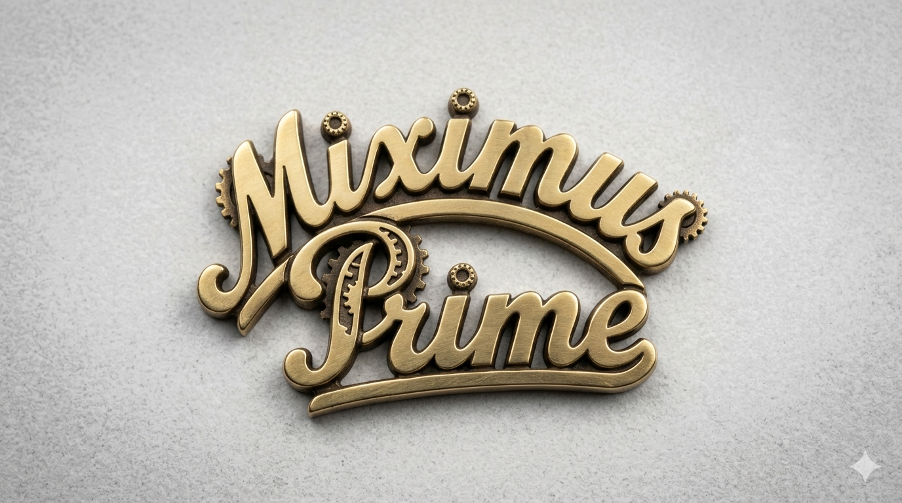

# Miximus Prime

My build of the Hector 9000 cocktail mixing robot

Apart from the original documentation at https://hackaday.io/project/161585-hector-9000 there are some other good builds on the web:

https://github.com/alesti/iso9001
https://www.golem.de/news/hector-9000-nachgebaut-der-automatische-cocktail-mixer-aus-dem-3d-drucker-1901-138927.html

I decided to do some changes on the design which are going to be doucmented here

- [UI](https://github.com/crjeder/Hector-9000/blob/master/UI.md)
- Design
- [Technology](https://github.com/crjeder/Hector-9000/blob/master/Technology.md)

## Project Structure
```kroki-blockdiag
blockdiag {
  orientation = portrait

  mcu [label = "Control Logic", color = "pink"];
  air [label ="Compressed Air", color = "orange"];
  v [label = "Valves", color = "green"];
  ui [label = "Display / Button", color = "lightblue"];
  www [label = "JiggerU", color = "lightblue"];
  s [label = "Sensors", color = "purple"]

  www -> "CocktailBotHAL" -> "REST API" -> mcu;
  mcu -> air;
  mcu -> v;
  mcu -> ui;
  mcu -> s;

  s -> "scales";
  s -> "air pressure"
}
```
[`JiggerU`](https://github.com/crjeder/JiggerU) provides a user interface for browsing and filtering Cocktails. It's installable on smart devices (via PWA/Add To Home Screen). These can either be provided and integrated into the Bot or BYOD.  
It interfaces with [`CocktailBotHAL`](https://github.com/crjeder/CocktailBotHAL) to send recipes and get status- and error messages from the bot. 
The bot hardware is `Miximus Prime`. It does not need a sophisticated UI, that's handled by `JiggerU`, instead.  
It is controlled by an implementation of `CocktailBotHAL` all the `control logic` goes ito the implementation.