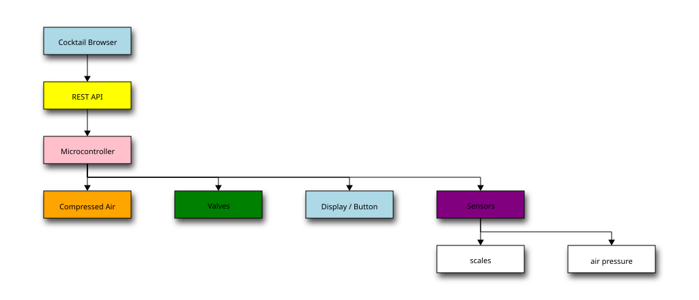
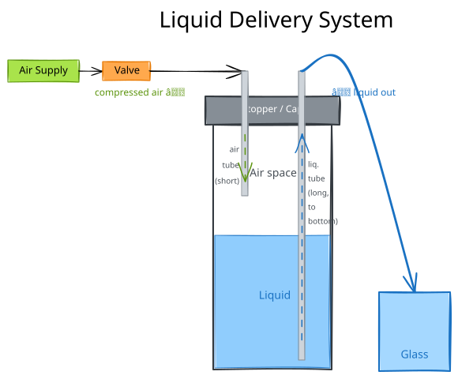
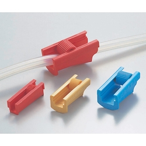
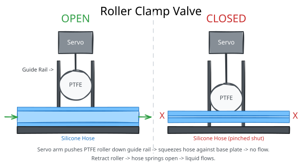
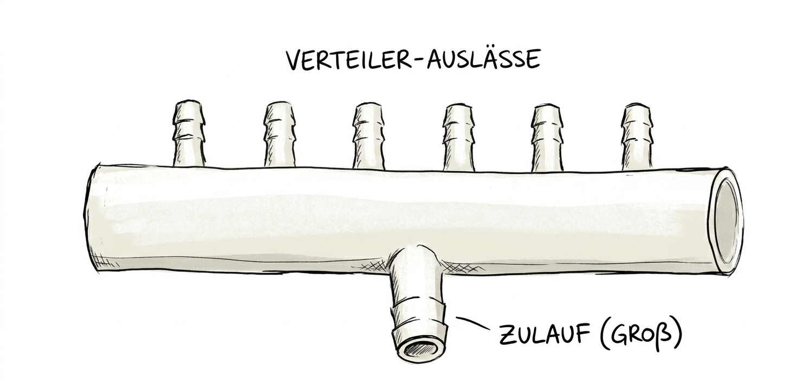

# Component Architecture

# Liquid Delivery System
Principle: Compressed air enters the bottle through a tube that ends just past the stopper. This overpressure pushes the liquid out through a second tube that starts just above the bottle bottom, directing it towards the glass. The valve in the air tube controls the flow rate.

## Valve

Prinziple: roller clamps like those used in medicine: A roll moves along a guide and squeezes the silicon hose until no liquid flows through.
The roller is made of PTFE and is pushed by a servo.

## Volume Measurement
To dispense the exact amounts of liquid the volume has to be measured. Direct measurement is difficult, therefore a wight scale continuously measures the weight of the glass. Together with the known density, the volume can be determined. The scales serve as a glass presence sensor, too.

## Compressed Air System
### Generation
A aquarium air pump is used to generate compressed air in a container. The pump runs on 230 V and is controlled by an [relay](https://www.pohltechnik.com/de/ssr-relais/ssr-lastschaltung-230v/ssr-halbleiter-solid-state-relais-dc-ac-230v-ac-10-a)
A GPIO on the microcontroller controls the relay.

## Air Distribution

## Valve Block
How to place the individual valves to safe space?
